# FleetSign User Manual

This manual explains how to run your screens day to day from the FleetSign web
interface: uploading media, setting playlists and schedules, controlling
playback, and managing a group of screens. It is written for the people who
operate the displays and the admin who looks after them.

It assumes FleetSign is already installed on the device and reachable on your
network. For installing the software, wiring up autostart, and the system level
service commands, see [INSTALL.md](../INSTALL.md). For a high level overview of
what FleetSign is and how the pieces fit together, see [README.md](../README.md).

## Contents

- [Key ideas](#key-ideas)
- [Opening the web interface](#opening-the-web-interface)
- [First-time setup](#first-time-setup)
- [Logging in](#logging-in)
- [The dashboard at a glance](#the-dashboard-at-a-glance)
- [Adding media](#adding-media)
- [The playlist](#the-playlist)
  - [Turning items on and off](#turning-items-on-and-off)
  - [How long an image shows](#how-long-an-image-shows)
  - [Scheduling by day and time](#scheduling-by-day-and-time)
  - [Changing the play order](#changing-the-play-order)
  - [Deleting an item](#deleting-an-item)
- [Settings](#settings)
- [Playback controls](#playback-controls)
- [Maintenance mode](#maintenance-mode)
- [Changing the password](#changing-the-password)
- [Running more than one screen](#running-more-than-one-screen)
  - [How a fleet works](#how-a-fleet-works)
  - [The Screens and sync panel](#the-screens-and-sync-panel)
  - [Adding a screen](#adding-a-screen)
  - [The screen interface](#the-screen-interface)
  - [Promoting a screen to master](#promoting-a-screen-to-master)
  - [Keeping versions in step](#keeping-versions-in-step)
- [Common tasks](#common-tasks)
- [Troubleshooting](#troubleshooting)
- [Quick reference](#quick-reference)

## Key ideas

A few terms are used throughout:

- **Screen.** One device (such as a Raspberry Pi) connected to one display. It
  loops your media fullscreen and brings itself back after a reboot or power cut.
- **Master.** The screen that hosts the full web interface where you manage
  media. A single screen on its own is a master with no others attached.
- **Slave (a "screen" in the interface).** An extra display that mirrors the
  master. It copies the master's playlist and media over the network every couple
  of minutes and shows the same content. Slaves have a reduced web interface.
- **Playlist.** The ordered list of images and videos. There is one playlist for
  the whole group: every screen shows the same thing. Top of the list plays
  first.

Whether a device is a master or a slave is just a setting you choose during
setup, not a different download. You can change it later.

Everything is controlled from the web interface. There are no commands to type
during normal use.

## Opening the web interface

From any computer, tablet, or phone on the same network, open a browser and go
to the screen's address:

```
http://<screen-ip>:8080
```

Each running screen also prints its own `http://<ip>:8080` address small in the
bottom-right corner of the display, so you can always read it off the screen
itself. Replace `<screen-ip>` with that address. (`8080` is the default port; if
yours was installed on a different port, use that instead.)

The interface works on a phone as well as a desktop browser, so you can adjust a
screen while standing in front of it.

## First-time setup

The first time you open a brand new screen, it asks how it should run.

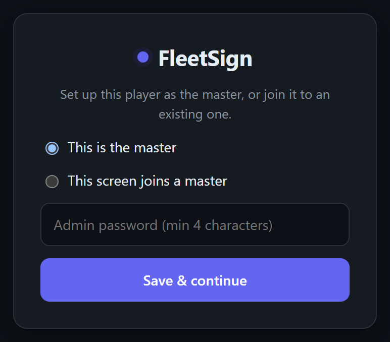

You have two choices:

- **This is the master.** Choose this for your first (or only) screen. Enter an
  admin password (at least 4 characters) and select **Save & continue**. That
  password is the only credential for the interface, so pick something you will
  remember and keep it private. After saving you are taken straight to the
  dashboard.
- **This screen joins a master.** Choose this for an extra display that should
  mirror an existing master. See [Adding a screen](#adding-a-screen) for the full
  walkthrough.

When you pick the join option, two fields appear instead of the password:

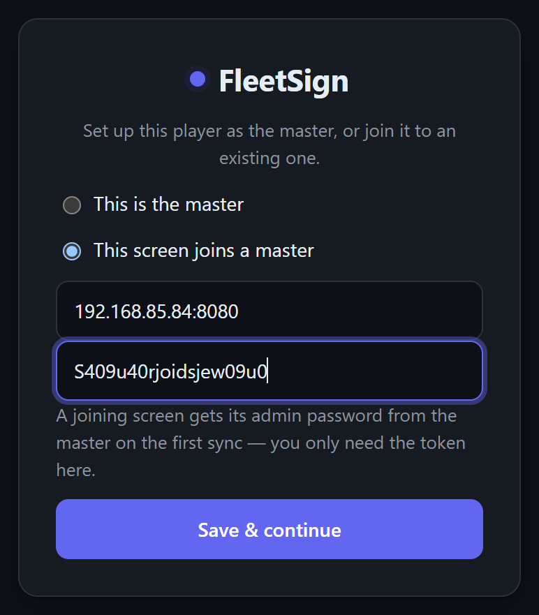

A joining screen does not need a password here. It receives the admin password
from the master on its first sync. You only enter the master's address and the
sync token. Both are described under [Adding a screen](#adding-a-screen).

## Logging in

Once a master has been set up, opening its address shows the login page. Enter
the admin password and select **Log in**.

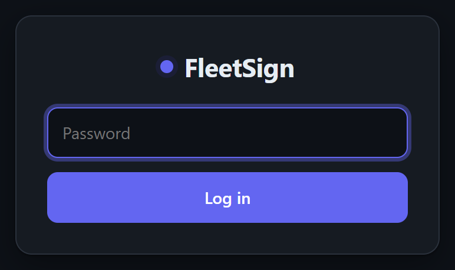

There is one shared password for the whole interface. There are no separate user
accounts. You stay logged in on that browser until you select **Log out** (top
right) or clear your cookies.

## The dashboard at a glance

After logging in to a master you see the dashboard. This is the whole control
surface, laid out top to bottom.

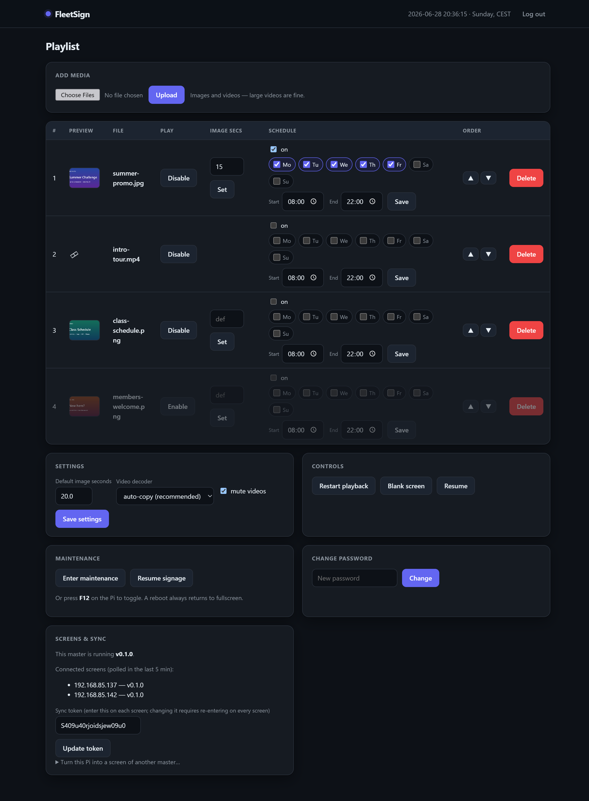

From here you can:

- Upload media (**Add media**).
- See and edit the playlist, including per-item duration, scheduling, order, and
  deletion (the table).
- Change playback **Settings** (default image time, video decoder, mute).
- Run playback **Controls** (restart, blank, resume).
- Put the screen into **Maintenance** for hands-on work at the device.
- Change the admin password.
- Manage extra screens and the sync token (**Screens & sync**).

The bar across the top shows the current date, day, and time as the screen sees
them, and adds a `MAINTENANCE` or `BLANKED` note when either is active. If the
device's clock looks wrong (some devices have no battery-backed clock and rely on
the network to set the time at boot), a warning appears here, because schedules
depend on a correct clock.

## Adding media

In the **Add media** panel, select **Choose Files**, pick one or more images or
videos, then select **Upload**.

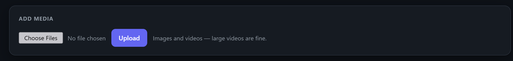

- You can select several files at once.
- Large videos are fine. Uploads of up to 4 GiB are accepted, so full length
  clips work, though a big file over a slow connection takes a while.
- Supported images: JPG, JPEG, PNG, GIF, WebP, BMP. Supported video: MP4, M4V,
  MKV, MOV, AVI, WebM, MPG, MPEG, WMV, FLV.
- Anything unsupported is skipped, and a short note tells you which file was
  ignored.

New uploads are added to the end of the playlist. They start playing within the
current loop, usually within seconds, so you do not need to restart anything.

## The playlist

The table lists every item in play order, from top to bottom. Each row has the
same controls.

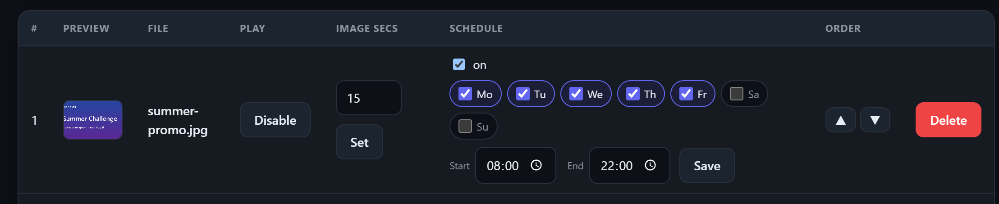

Reading the columns left to right:

- **#** is the position in the loop.
- **Preview** shows a thumbnail for images, or a film icon for videos.
- **File** is the file name. If the file is somehow missing from storage, a
  `missing` tag appears here and the item is skipped until it is fixed.
- **Play** turns the item on or off (see below).
- **Image secs** sets how long an image stays on screen (images only).
- **Schedule** limits an item to certain days and times.
- **Order** moves the item up or down.
- The red **Delete** button removes the item.

### Turning items on and off

Use the **Disable** button to take an item out of the loop without deleting it.
A disabled row is dimmed and its button changes to **Enable** so you can bring it
back later. This is the quick way to pull a notice temporarily without losing the
file or its schedule.

### How long an image shows

The **Image secs** box sets how many seconds an image is displayed before the
loop moves on. Type a number and select **Set**. Leave it blank (it shows `def`)
to use the global default from [Settings](#settings).

Videos ignore this. A video always plays to its end, then the loop advances.

### Scheduling by day and time

By default an item plays in every loop. To restrict it, tick **on** in the
Schedule column, then choose when it should appear:

- **Days of the week.** Tick the days it should play (Mo, Tu, We, Th, Fr, Sa,
  Su). If you leave every day unticked, the item plays on all days within the
  time window.
- **Start and End time.** The item only plays between these two times. For
  example, Start 08:00 and End 22:00 keeps a notice on during opening hours and
  drops it overnight.
- **Overnight windows** are allowed. If End is earlier than Start (for example
  22:00 to 02:00), the window runs across midnight. The part after midnight
  counts as the day the window started on.

Select **Save** to apply the schedule. Outside its window, or on days you did not
pick, the item is left out of the loop automatically and rejoins when the time
comes round again. Scheduling depends on the device having the correct time, so
take the clock warning in the top bar seriously if it appears.

### Changing the play order

Use the up and down arrows in the **Order** column to move an item earlier or
later. The order in the table is the order things play, looping back to the top
after the last item.

### Deleting an item

The red **Delete** button removes the item from the playlist and deletes its
file from the device. You are asked to confirm first. This cannot be undone, so
to hide something temporarily use **Disable** instead.

## Settings

The **Settings** panel holds playback options that apply to the whole playlist.

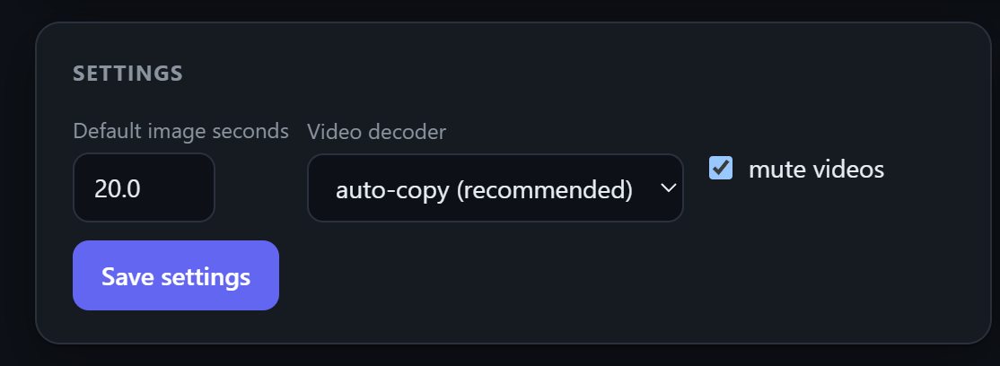

- **Default image seconds.** How long images show when a row has no specific time
  set in its **Image secs** box. The default is 20 seconds.
- **Video decoder.** How videos are decoded. Leave this on **auto-copy
  (recommended)** unless you have a reason to change it. **no (software)** forces
  software decoding, which is slower but a useful fallback for awkward video.
  **auto (may blue-screen)** can fail on some hardware, so only try it if you
  know it works on your device. Changing the decoder restarts playback.
- **mute videos.** Whether videos play with sound. It is on (muted) by default,
  which is usually what you want on a wall display.

Select **Save settings** to apply.

## Playback controls

The **Controls** panel acts on the display right now.

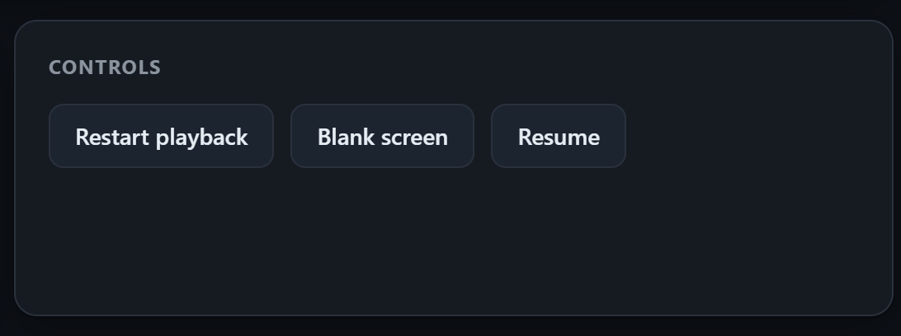

- **Restart playback** starts the loop again from the top. Useful after big
  changes, or if something looks stuck.
- **Blank screen** stops playback and turns the display black, while leaving the
  screen powered on.
- **Resume** ends the blank and starts the playlist again.

## Maintenance mode

Maintenance mode is for when someone needs to use the device's own desktop, for
example to do work on the machine itself.

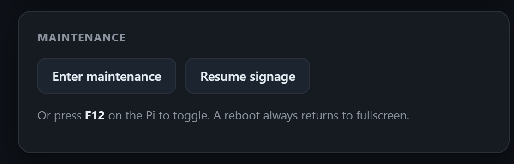

- **Enter maintenance** drops the player out of fullscreen and pauses it, so the
  desktop underneath is usable.
- **Resume signage** brings the playlist cleanly back to fullscreen.
- At the device itself you can press **F12** to toggle the same thing without the
  web interface.

Maintenance is never permanent. A reboot always returns to normal fullscreen
signage, so even if a screen is left in maintenance, the next restart puts it
back to work.

## Changing the password

In the **Change password** panel, type a new password (at least 4 characters)
and select **Change**. The new password applies to the whole interface from then
on. If you run a group of screens, the new password is also pushed out to the
other screens on their next sync, so they all keep using the same login.

## Running more than one screen

You can run a group of screens that all show the same content. One is the master
(where you manage everything) and the rest are slaves that mirror it.

### How a fleet works

- The master holds the real playlist and media.
- Each slave checks in with the master every couple of minutes, downloads
  anything new or changed, removes anything you deleted, and plays the same loop.
- There is one playlist for the whole group. You cannot show different content on
  different screens. Enable, disable, and schedules apply everywhere. If you need
  two different playlists, run two separate masters.
- If a slave is switched off for a while, it catches up on its own once it is
  back.

### The Screens and sync panel

On the master, the **Screens & sync** panel is where you manage the group.

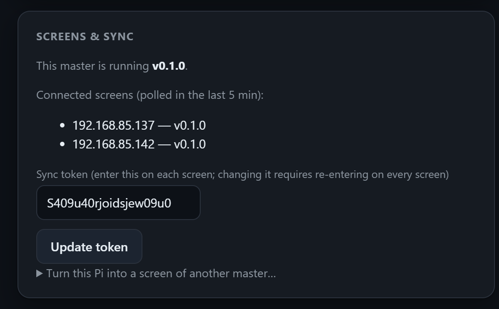

- It shows which version this master is running.
- **Connected screens** lists the screens that have checked in during the last 5
  minutes, by address, along with the version each one reports. A note appears
  next to any screen whose version differs from the master.
- **Sync token** is the shared secret a screen needs in order to mirror this
  master. Treat it like a password. You enter it on each screen when you join it.
  If you change the token here, every screen stops syncing until you re-enter the
  new token on each one, so change it only when you mean to.

### Adding a screen

To add a display:

1. Note the master's address and its sync token from the **Screens & sync**
   panel.
2. Open the new screen's web interface and choose **This screen joins a master**
   on its setup page (see [First-time setup](#first-time-setup)).
3. Enter the master's address (for example `192.168.85.84:8080`) and the sync
   token, then select **Save & continue**.

The new screen restarts and begins mirroring. Until its first successful sync it
shows a waiting page:

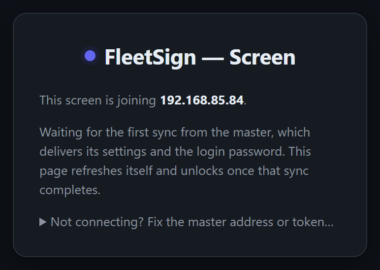

This page refreshes itself and unlocks as soon as the first sync arrives, which
also delivers the login password from the master. If it cannot reach the master,
it says why (for example a wrong address or token) so you can fix it on the spot.
Open **Not connecting? Fix the master address or token** to correct the details
or, if needed, promote the screen to master.

To add several identical screens, set one up as a slave and clone its storage
card to the others. They come up already joined, with no further setup. A full
walkthrough, including static addresses, is in
[INSTALL.md](../INSTALL.md#multiple-screens-master--slaves).

### The screen interface

A slave shows a reduced interface focused on its own display.

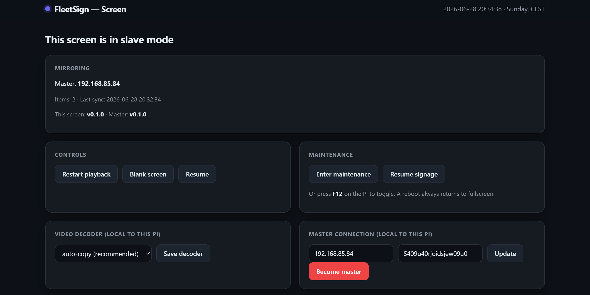

- **Mirroring** shows which master it follows, how many items it has, when it
  last synced, and the versions in use.
- **Controls** and **Maintenance** work exactly as on the master, but only affect
  this one display.
- **Video decoder (local to this Pi)** lets each screen pick its own decoder.
  This setting is per device and is not synced, because different hardware can
  need different decoders.
- **Master connection (local to this Pi)** shows the master address and token
  this screen uses, with an **Update** button if you ever need to change them.

The playlist, schedules, and media are all managed on the master. There is
nothing to edit here beyond the local decoder and the master connection.

### Promoting a screen to master

If the master fails, slaves keep playing their last synced content, but you
cannot edit anything until a master is available again. Any screen can be
promoted:

- On the screen's interface, select **Become master** (under Master connection).
- Confirm. The device restarts as a master and serves the full management
  interface at its own address.

This is a manual step on purpose. Take care to promote only one screen, then
point the others at its address if you want them to follow it.

### Keeping versions in step

A master upgrade does not update its screens automatically. Updates are installed
on each device separately. Mixed versions keep working, and the interface simply
flags any difference (in the master's **Connected screens** list, and on a
screen's own status page) so you can see when something is out of step and update
it when convenient.

## Common tasks

Short answers to everyday questions.

- **Put up a new poster.** Add media, upload the image, and (if needed) move it
  into place with the Order arrows. Set its display time in Image secs.
- **Replace an existing poster.** Upload the new file, then delete the old one.
  Reorder if you want it in the same spot.
- **Show a notice only during opening hours.** Tick Schedule **on** for that item
  and set the Start and End times (and days, if it is not every day).
- **Hide something for now without losing it.** Select **Disable** on its row.
  Select **Enable** to bring it back.
- **Reorder the loop.** Use the up and down arrows in the Order column.
- **Turn the display dark temporarily.** Use **Blank screen**, then **Resume**
  when you want it back.
- **Work on the device's desktop.** Use **Enter maintenance** (or F12 at the
  device), then **Resume signage** (or F12 again) when done.
- **Add another identical screen.** Join it to the master, then clone its card to
  make more.

## Troubleshooting

- **"Wrong password" on login.** The interface uses one shared admin password. If
  you changed it recently on the master, screens pick up the change on their next
  sync, so allow a couple of minutes. There is no self-service reset; recovery is
  done at the device (see [INSTALL.md](../INSTALL.md#troubleshooting)).
- **A clock warning in the top bar.** The device's time looks unset. Schedules
  will be wrong until it corrects. Make sure the device can reach the network at
  boot so it can set its clock.
- **Items play at the wrong times or on the wrong days.** Scheduling uses each
  screen's own system clock. If a screen's time, date, or time zone is off, it
  runs the schedule against the wrong moment, so scheduled items show in the wrong
  slots, on the wrong days, or drop out of the loop. Check the time shown in the
  top bar. The clock and time zone must be set correctly on every screen (a
  Raspberry Pi has no battery-backed clock and relies on the network to set its
  time at each boot). Configuring this is covered in
  [INSTALL.md](../INSTALL.md#set-the-time-and-time-zone-required-for-schedules).
- **A `missing` tag on a playlist item.** The media file is not present in
  storage. The item is skipped. Re-upload the file, or delete the row.
- **A screen is not syncing.** Check the master address and sync token on that
  screen (Master connection), and that the token there matches the master's. The
  screen's status or waiting page shows the reason it cannot connect. Remember
  that changing the token on the master requires re-entering it on every screen.
- **Video shows a blank or coloured screen.** Try a different **Video decoder** in
  Settings (on a master) or in the local decoder panel (on a screen). Start with
  **auto-copy**, then try **no (software)**. Avoid **auto** unless you know it
  works on that hardware.
- **A "version differs" or "version mismatch" note.** A screen is running a
  different FleetSign version than the master. This is not fatal, but update them
  to match when you can. Updates are applied per device.
- **Nothing changed after I edited the playlist.** Edits take effect within the
  current loop, usually within seconds. If it still looks stuck, use **Restart
  playback**.

For service level problems (the device not coming back after a reboot, logs,
updating the software), see [INSTALL.md](../INSTALL.md).

## Quick reference

| Action | Where |
|---|---|
| Open a screen's interface | `http://<screen-ip>:8080` (also shown bottom-right on the display) |
| Upload media | Add media, Choose Files, Upload |
| Set how long an image shows | Image secs on the row, or Default image seconds in Settings |
| Limit an item to set days and times | Schedule on, pick days and Start/End, Save |
| Reorder | Up and down arrows in Order |
| Hide without deleting | Disable on the row |
| Restart the loop | Controls, Restart playback |
| Darken the display | Controls, Blank screen (Resume to restore) |
| Use the device desktop | Maintenance, Enter maintenance, or F12 at the device |
| Change the login password | Change password panel |
| Add another screen | Screens & sync (get token), then join the new screen |
| Recover a failed master | On a screen, Become master |

Limits worth knowing:

- One playlist for the whole group; no per-screen content.
- One fullscreen image or video at a time; no overlays, text, or layouts.
- One display per device.
- One shared password; no separate user accounts.
- Designed for a trusted local network, over plain HTTP. Do not expose it
  directly to the internet.

For installation, autostart, service commands, and the deployment checklist, see
[INSTALL.md](../INSTALL.md). For an overview of the project, see
[README.md](../README.md).
